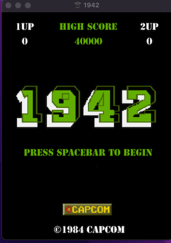
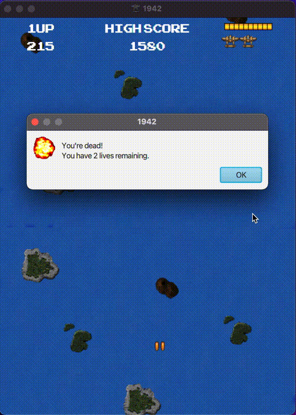

# 1942 Game
Inspired by the retro vertical scrolling 1942 shooter game using JavaFX. Players use the mouse to control the plane as it shoots incoming enemy planes using the spacebar. If enemy planes manage to slip through the player's line of fire they lose one health and if all health is lost, or they collide with an enemy plane they die and lose one of their total 3 lives. As time goes the game get progressively harder and the planes gain more health and fly faster.

# Instructions/Notes

Download and install Eclipse IDE

Download zipped clone from repository, extract, and open as new eclipse project

Please refer to this youtube video for instructions on the installation/implementation of JavaFX for the Eclipse IDE (https://www.youtube.com/watch?v=bk28ytggz7E&t=317s)

You may experience problems with background music and sound effects.

# Contributers
Junior Green<<juniorgreen@cmail.carleton.ca>>

# Gallery
**Home screen**

**Shooting enemy planes**

**Running out of health**

**Enemy plane collision**

